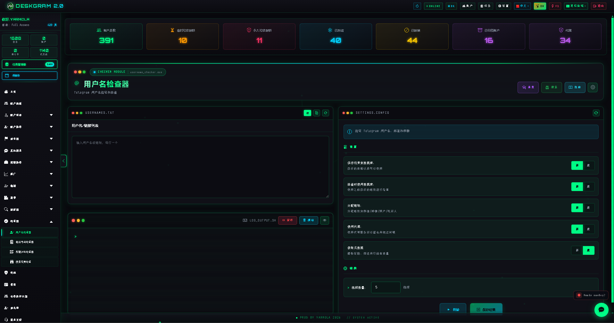
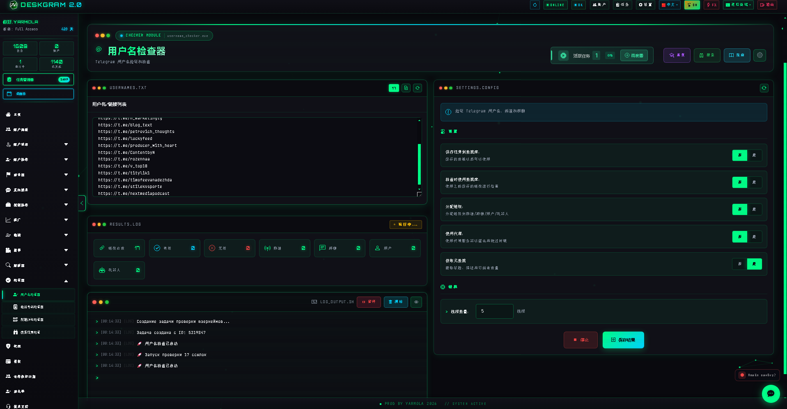
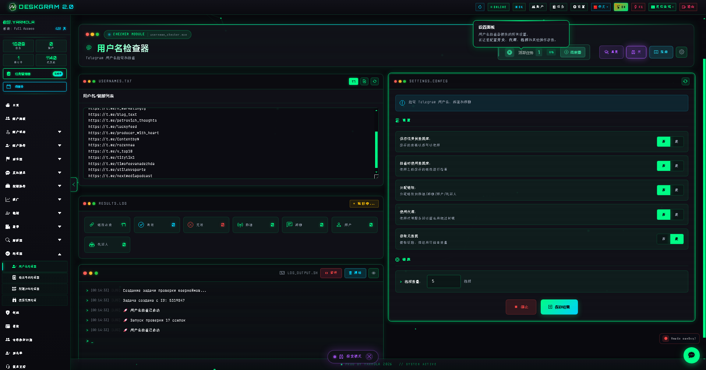
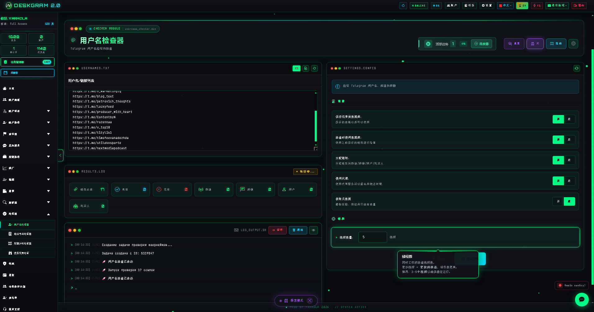

# Deskgram 2 Telegram 用户名检查器

Deskgram 2 的 Telegram 用户名检查器可以在 messaging、parser 或 engagement 路线开始之前，先验证用户名和 Telegram 链接。这个模块适合在原始名单还比较杂、需要先做验证、类型识别和清洗时使用。

[Deskgram 2 Hub](https://github.com/Deskgram-2/deskgram-2-telegram-automation-zh) · [Website](https://deskgram2.com/) · [Telegram Bot](https://t.me/DG2welcomebot) · [Web Preview](https://deskgram2.com/web-preview?path=%2Fapp-demo%2F&lang=cn)

## 交互式 Web Preview

在浏览器里查看模块界面：[打开 web preview](https://deskgram2.com/web-preview?path=%2Fapp-demo%2Ffunctions%2Fusername_checker&lang=cn)

这样你可以先看验证设置、结果区域和线程控制，再决定是否大规模跑检查。

## Screenshots

## 模块概览

| 参数 | 内容 |
|---|---|
| 核心任务 | 在下游执行前验证 Telegram 用户名和链接 |
| 重要模块 | 结果区、设置、线程控制、对象类型识别 |
| 适用场景 | 数据清洗、lead 验证、更稳定的 discovery 准备 |
| 相关模块 | 手机号检查、受众采集、任务管理、代理管理 |

## 模块能力

- 在结果进入下一条路线前验证 Telegram 用户名和链接；
- 识别对象类型，减少低质量条目；
- 用线程设置处理更大的验证批次；
- 在 parser 或 outreach 前先清理名单；
- 降低下游执行阶段的噪音。

## 快速开始

1. 导入用户名或链接列表。
2. 配置检查设置和线程行为。
3. 如有需要，分配账号或基础设施层。
4. 运行验证并查看结果。
5. 只把干净条目送到下游模块。

## 最适合和哪些模块联动

- [手机号检查](https://github.com/Deskgram-2/telegram-phone-checker-deskgram)
- [受众采集](https://github.com/Deskgram-2/telegram-audience-parser-deskgram-zh)
- [代理管理](https://github.com/Deskgram-2/telegram-proxy-manager-deskgram-zh)
- [任务管理](https://github.com/Deskgram-2/telegram-task-manager-deskgram-zh)

## 什么时候特别有用

- 当原始用户名名单还需要先做清洗；
- 当 Telegram 链接来自不同来源，必须先验证；
- 当 discovery 或 parser 路线应该从更干净的数据开始；
- 当你想在 outreach 或 engagement 前减少浪费。

## 选哪个：用户名检查器还是手机号检查器

| 如果你的目标是 | 更适合 |
|---|---|
| 验证用户名和 Telegram 链接 | `用户名检查器` |
| 验证手机号层面的账号数据 | [手机号检查](https://github.com/Deskgram-2/telegram-phone-checker-deskgram) |
| 在 parser 或 outreach 前清洗名单 | `用户名检查器` |
| 审计手机号质量 | [手机号检查](https://github.com/Deskgram-2/telegram-phone-checker-deskgram) |

## Related repositories

- [Deskgram 2 Hub](https://github.com/Deskgram-2/deskgram-2-telegram-automation-zh)
- [手机号检查](https://github.com/Deskgram-2/telegram-phone-checker-deskgram)
- [受众采集](https://github.com/Deskgram-2/telegram-audience-parser-deskgram-zh)
- [代理管理](https://github.com/Deskgram-2/telegram-proxy-manager-deskgram-zh)
- [任务管理](https://github.com/Deskgram-2/telegram-task-manager-deskgram-zh)

## FAQ

### 可以先在浏览器里看模块吗？

可以。web preview 已经能直接展示验证布局、设置和线程区域。

### 只能检查用户名，不能检查链接吗？

不是。这个模块同时适合 Telegram 用户名和链接，只要输入列表需要先做验证和清洗。
